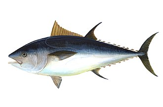

```{r setup, include=FALSE}
library(dplyr)
knitr::opts_chunk$set(echo = FALSE)
```


## Introduction

This site documents the initial development of the MSA model for Atlantic bluefin in 2026, including R code repositories and SCRS reports.

## Code repository 

R code [repository](https://github.com/Blue-Matter/BFT-MSA-2026)

## SCRS papers

Huynh, Q.C. 2026. Development of the multi-stock age-structured model for Atlantic bluefin tuna in 2026. Collect. Vol. Sci. Pap. [SCRS/2026/165](https://docs.google.com/document/d/1NBuCMat-nqH9Xnx7kLRJPcjj6OL0581o/edit?usp=sharing&ouid=110611304283721893731&rtpof=true&sd=true)

Huynh, Q.C. and Hanke, A. 2026. Step-wise development of mixed-stock population models for Atlantic bluefin tuna in 2026, with fleet-specific stock mixing estimates in the West Atlantic. Collect. Vol. Sci. Pap. [SCRS/2026/224](https://docs.google.com/document/d/1cwcJJraX5mYcyyppyanTBLlqlRmYraX6/edit?usp=sharing&ouid=110611304283721893731&rtpof=true&sd=true)

## multiSA (MSA) R package

CRAN [repository](https://cran.r-project.org/package=multiSA)

Source code [Github repository](https://github.com/Blue-Matter/multiSA)

Documentation [webpage](https://blue-matter.github.io/multiSA/)

## Acknowledgements

Support for the development of multiSA was provided by the NOAA Fisheries Bluefin Tuna Research Program (BTRP Grants NA23NMF4720184 and NA24NMFX472C0008-T1-01) in collaboration with the Ocean Foundation.

This work was carried out under the provision of the ICCAT Atlantic-Wide Research Programme for Bluefin Tuna (GBYP). The contents of this document do not necessarily reflect the point of view of ICCAT, which has no responsibility over them, and in no ways anticipate the Commission’s future policy in this area.
This work was conducted with the funding support of the ICCAT GBYP budget and was partially funded by the European Union through the EU Grant Agreement No. 101320145.
